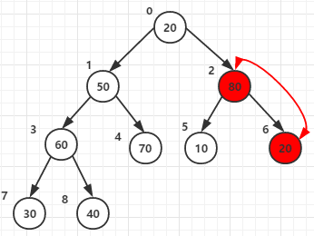
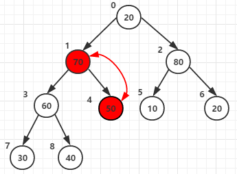
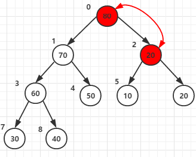

# 堆排序

堆排序（Heapsort）是指利用堆这种数据结构所设计的一种排序算法。堆积是一个近似完全二叉树的结构，并同时满足堆积的性质：即子结点的键值或索引总是小于（或者大于）它的父节点。堆排序可以说是一种利用堆的概念来排序的选择排序。分为两种方法：

1. 大顶堆：每个节点的值都大于或等于其子节点的值，在堆排序算法中用于升序排列；
2. 小顶堆：每个节点的值都小于或等于其子节点的值，在堆排序算法中用于降序排列；

堆排序的平均时间复杂度为 Ο(nlogn)。

## 补充说明

算法思想(以大顶堆为例)：

1.将长度为n的待排序的数组进行堆有序化构造成一个大顶堆

 	初始化大顶堆(从最后一个有子节点开始往上调整最大堆)
 
2.将根节点与尾节点交换并输出此时的尾节点

	堆顶元素与最后一个元素交换，交换后堆长度减一。
	交换之后可能造成被交换的孩子节点不满足堆的性质，因此每次交换之后要重新对被交换的孩子节点进行调整
	堆顶元素(最大数)与堆最后一个数交换后，需再次调整成大顶堆，此时是从上往下调整的。
 
3.将剩余的n -1个节点重新进行堆有序化
 
4.重复步骤2，步骤3直至构造成一个有序序列
 
假设待排序数组为[20,50,10,30,70,20,80]
### 构造堆
在构造有序堆时，我们开始只需要扫描一半的元素（n/2-1 ~ 0）即可，为什么?
因为(n/2-1)~0的节点才有子节点，如图，n=8,(n/2-1) = 3  即3 2 1 0这个四个节点才有子节点







## 1. 算法步骤

1. 创建一个堆 H[0……n-1]；

2. 把堆首（最大值）和堆尾互换；

3. 把堆的尺寸缩小 1，并调用 shift_down(0)，目的是把新的数组顶端数据调整到相应位置；

4. 重复步骤 2，直到堆的尺寸为 1。


## 2. 动图演示


## 3. JavaScript 代码实现

```js
var len;    // 因为声明的多个函数都需要数据长度，所以把len设置成为全局变量

function buildMaxHeap(arr) {   // 建立大顶堆
    len = arr.length;
    for (var i = Math.floor(len/2); i >= 0; i--) {
        heapify(arr, i);
    }
}

function heapify(arr, i) {     // 堆调整
    var left = 2 * i + 1,
        right = 2 * i + 2,
        largest = i;

    if (left < len && arr[left] > arr[largest]) {
        largest = left;
    }

    if (right < len && arr[right] > arr[largest]) {
        largest = right;
    }

    if (largest != i) {
        swap(arr, i, largest);
        heapify(arr, largest);
    }
}

function swap(arr, i, j) {
    var temp = arr[i];
    arr[i] = arr[j];
    arr[j] = temp;
}

function heapSort(arr) {
    buildMaxHeap(arr);

    for (var i = arr.length-1; i > 0; i--) {
        swap(arr, 0, i);
        len--;
        heapify(arr, 0);
    }
    return arr;
}
```
## 4. Python 代码实现

```python
def buildMaxHeap(arr):
    import math
    for i in range(math.floor(len(arr)/2),-1,-1):
        heapify(arr,i)

def heapify(arr, i):
    left = 2*i+1
    right = 2*i+2
    largest = i
    if left < arrLen and arr[left] > arr[largest]:
        largest = left
    if right < arrLen and arr[right] > arr[largest]:
        largest = right

    if largest != i:
        swap(arr, i, largest)
        heapify(arr, largest)

def swap(arr, i, j):
    arr[i], arr[j] = arr[j], arr[i]

def heapSort(arr):
    global arrLen
    arrLen = len(arr)
    buildMaxHeap(arr)
    for i in range(len(arr)-1,0,-1):
        swap(arr,0,i)
        arrLen -=1
        heapify(arr, 0)
    return arr
```

## 5. Go 代码实现

```go
func heapSort(arr []int) []int {
	arrLen := len(arr)
	buildMaxHeap(arr, arrLen)
	for i := arrLen - 1; i >= 0; i-- {
		swap(arr, 0, i)
		arrLen -= 1
		heapify(arr, 0, arrLen)
	}
	return arr
}

func buildMaxHeap(arr []int, arrLen int) {
	for i := arrLen / 2; i >= 0; i-- {
		heapify(arr, i, arrLen)
	}
}

func heapify(arr []int, i, arrLen int) {
	left := 2*i + 1
	right := 2*i + 2
	largest := i
	if left < arrLen && arr[left] > arr[largest] {
		largest = left
	}
	if right < arrLen && arr[right] > arr[largest] {
		largest = right
	}
	if largest != i {
		swap(arr, i, largest)
		heapify(arr, largest, arrLen)
	}
}

func swap(arr []int, i, j int) {
	arr[i], arr[j] = arr[j], arr[i]
}
```
